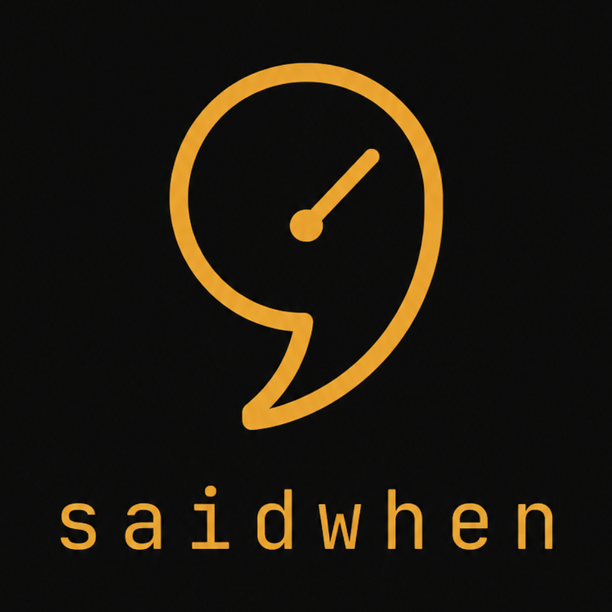

<p align="center"></p>

# saidwhen

[](https://github.com/h4nz4/saidwhen/actions/workflows/ci.yml)
[](LICENSE)
[](validator/validate.py)
[](validator/validate.py)
[](https://github.com/GoogleCloudPlatform/knowledge-catalog/blob/main/okf/SPEC.md)

> Your project's wiki, maintained by your agents — and actually trustworthy.

**saidwhen** is an agent-maintained project wiki in a loop with
[OpenSpec](https://github.com/Fission-AI/OpenSpec). One
[OKF](https://github.com/GoogleCloudPlatform/knowledge-catalog/blob/main/okf/SPEC.md)
bundle of plain markdown serves three readers at once: **agents** read it as
project memory before every task, the **spec workflow** draws on it and
feeds it, and **humans** browse it as a compiled wiki site. What makes it
trustworthy is built-in provenance plumbing: every entry knows *who said it,
when, and what would reopen it* — so agents can challenge stale knowledge
instead of blindly obeying or silently ignoring it. No server, no database,
no vector index, no SDK.

```
 spec requirement          decision                 attributed fact
┌──────────────────┐     ┌──────────────────┐     ┌──────────────────┐
│ "MUST use magic  │────▶│ chose magic links│────▶│ users are        │
│  link login"     │ why?│ over OAuth       │ who │ external, no IdP │
│                  │     │ because...       │said?│ —ivan, 2026-07-08│
└──────────────────┘     └──────────────────┘     └──────────────────┘
```

Six months later someone asks "can we add OAuth?" — the agent follows the
links, finds it was rejected and why, and asks only: *"decided 2026-07-08
because users have no IdP — is that still true?"* No re-litigating, no
re-interviewing, no blind obedience.

## The loop

- **In:** exploring or proposing an [OpenSpec](https://github.com/Fission-AI/OpenSpec)
  change consults the wiki first and pulls the relevant facts, constraints,
  and decisions into the proposal — by link, not by re-asking you.
- **Out:** archiving a change writes the crystallized knowledge back and
  updates the architecture pages it altered — and an optional
  [Stop hook](skills/wiki-opsx-archive/scripts/wiki-after-openspec.py) makes
  it automatic, blocking only when the wiki has fallen behind an archive and
  staying silent (zero tokens) when it hasn't.
- **Checked:** the [validator](validator/validate.py) resolves every link,
  flags citations of superseded decisions, and maps a PR's changed files
  back to the decisions that govern them.
- **Rendered:** CI compiles the bundle into a browsable wiki site on every
  push ([latest build](https://github.com/h4nz4/saidwhen/actions/workflows/ci.yml)
  → `wiki-site` artifact) — rich pages for humans, zero extra tokens for
  agents, regenerated instead of maintained. The output is plain static
  HTML: host it anywhere, or render the single-file `wiki.html` and open it
  from disk.

## Quickstart (5 minutes)

1. Install the skills — one command:
   - **Any agent** (Claude Code, Cursor, Codex, 20+ others):
     `npx skills add h4nz4/saidwhen`
   - **Claude Code** (full suite as a plugin):
     `/plugin marketplace add h4nz4/saidwhen` then
     `/plugin install saidwhen@saidwhen`
   - **Or copy** directories from [skills/](skills/) into your agent's skills
     folder — `.claude/skills/` (Claude Code), `.agents/skills/` (Codex), or
     your agent's equivalent ([install matrix](skills/README.md)). Minimal
     set: `wiki-init`, `wiki-explore`, `wiki-capture`.
2. Ask your agent to set up the wiki — `wiki-init` scaffolds `docs/knowledge/`
   and offers the [AGENTS.md snippet](skills/wiki-init/assets/snippet.md), the
   ambient fallback for agents without Agent Skills support.
3. Work normally. Your agent now reads `docs/knowledge/` before asking you
   anything, and records facts and decisions as they crystallize.

Optional: vendor [validator/validate.py](validator/validate.py) (one stdlib
file) and run `python validate.py docs/knowledge` in CI — the wiki-capture
skill also bundles it. [OpenSpec](https://github.com/Fission-AI/OpenSpec)
user? Install the `wiki-opsx-*` skills — that's the loop above.

## The trust layer measurably works

The wiki's integrity behaviors — recall instead of re-planning, the delta
question instead of blind obedience, no fabricated citations — and the 2.0
wiki-first claims are backed by pre-registered experiments with published
transcripts across five rounds, zero rubric exceptions.

| Claim | Evidence | Result |
|---|---|---|
| Recalls rejected features instead of re-planning them | [round 1](evidence/experiment/results.md) | 6/6 vs control 0/6, p ≈ 0.0011 |
| Reopens stale decisions via their own revisit triggers — no blind obedience | [rounds 2+3](evidence/experiment/round3/results.md) | 6/6 vs 0/6, p ≈ 0.0011 |
| Shapes ordinary proposals around recorded constraints | [rounds 2+3](evidence/experiment/round3/results.md) | 6/6 vs 0/6, p ≈ 0.0011 |
| Handles uncovered topics without fabricating provenance | [round 3](evidence/experiment/round3/results.md) | 6/6 vs 0/6, p ≈ 0.0011; 9/9 clean on the fabrication probe |
| Same behavior when delivered as an auto-triggering skill — on two different agent CLIs | [round 4](evidence/experiment/round4-skill-trigger/results.md) | 36/36 runs pass both rubrics; skill auto-triggered 24/24 |
| **Wiki-first is more accurate AND cheaper** on the same consult prompts (onboarding + conflicting-rewrite) | [round 6](evidence/experiment/round6-consult/results.md) | 6/6 vs 0/6, p ≈ 0.0011; **−33% billable tokens/session**, p ≈ 0.0076 |

Full write-up: [evidence/VALIDATION.md](evidence/VALIDATION.md). Honest
limitations included (single model family, demo-sized wikis, unblinded
scoring with published raw outputs; round 6 ran lean — 12 sessions at low
reasoning effort — per a recorded owner directive, with all amendments
registered before the first run).

### And this repo runs on it

[docs/knowledge/](docs/knowledge/) is saidwhen's own live bundle, not a demo. Why is
the product wiki-first now? [The decision](docs/knowledge/decisions/okf-wiki-pivot.md)
answers, linked to the [owner interview](docs/knowledge/interviews/2026-07-08-wiki-pivot.md)
that justified it — the same chain the diagram above promises you. CI
validates the bundle, renders the site, and checks this README against the
bundle for broken links *and* citations of superseded decisions, on every
push. saidwhen itself is developed with
[OpenSpec](https://github.com/Fission-AI/OpenSpec) through the `wiki-opsx-*`
skills we ship: the loop you get is the one we use daily.

## Docs that don't rot

Any in-repo markdown — architecture notes, `docs/`, even your `AGENTS.md` —
can carry the same why-links as specs — like this real one:
([why](example/knowledge/decisions/magic-link-auth.md)). Then

```
python validator/validate.py docs/knowledge --check-specs AGENTS.md --check-specs openspec/specs
```

fails CI when a link breaks **or when a cited decision has been superseded**:
the doc leaning on a stale why gets flagged, with its successor named. Docs
stop silently outliving the decisions under them.

The reverse direction works too: give a decision a `scope:` of the paths it
governs, and

```
git diff --name-only main | python validator/validate.py docs/knowledge --check-diff -
WHY   decisions/eur-only.md (accepted) governs: index.html
```

tells a PR review — human or agent — which recorded decisions a change
touches, before it quietly rebuilds something already rejected. Advisory
output; it never fails the run.

## What's in the box

| Layer | What | Where |
|---|---|---|
| **Bundle convention** | Wiki layout, concept types, fact-form capture, linking rules, decision lifecycle, upkeep and render contracts. One page, versioned. | [CONVENTION.md](CONVENTION.md) |
| **Behaviors** | Tool-agnostic prompts: [read-first](behaviors/read-first.md), [capture](behaviors/capture.md), [bootstrap](behaviors/bootstrap.md), [component-upkeep](behaviors/component-upkeep.md), [gc](behaviors/gc.md). The validated wording. | [behaviors/](behaviors/) |
| **Skills** | Drop-in [Agent Skills](https://agentskills.io/home) (open standard, any supporting agent): init, bootstrap, explore, capture, render, gc, [OpenSpec](https://github.com/Fission-AI/OpenSpec) loop. The ambient [AGENTS.md snippet](skills/wiki-init/assets/snippet.md) ships inside wiki-init as the fallback. | [skills/](skills/) |
| **Renderer** | Bundle → browsable static wiki site. Stdlib, one file, disposable output. | [render/](render/) |
| Demo | TaskLite — browse a working knowledge chain on GitHub. | [example/](example/) |
| Validator | Frontmatter, links, evidence and attribution rules, docs-rot and diff checks. Stdlib, one file. | [validator/](validator/) |
| Proof | Protocols, 54 raw transcripts, scoring, statistics. | [evidence/](evidence/) |

## How it's different from agent-memory tools

Memory tools capture **everything ambiently** (transcripts, embeddings) and
hope retrieval finds the needle. saidwhen captures **at the moment knowledge
crystallizes** — the point of highest signal — as attributed facts a human
can browse on GitHub and an agent can cite by path. It is a format and a
behavior, not a platform: produced without an SDK, consumed without an
integration, portable between agents, and it degrades gracefully to
well-organized docs.

## License

[MIT](LICENSE). Contributions welcome — see [CONTRIBUTING.md](CONTRIBUTING.md),
especially the rule about re-validating behavior edits.
