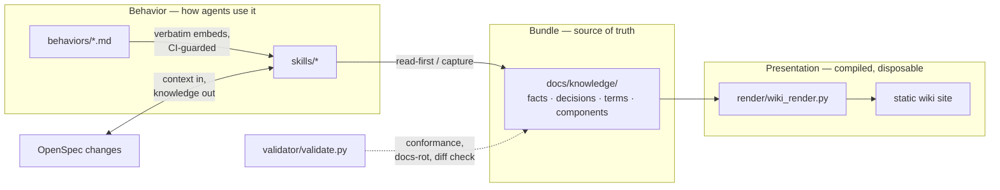

# Three-layer architecture

**Why three layers.** The bundle stays small because agents pay to read it
on every task — richness would tax every session
([why](../decisions/okf-wiki-pivot.md)). Behaviors are the validated
wording; skills are delivery vehicles that embed it verbatim so there is
exactly one normative source ([why](../decisions/skills-first-distribution.md)).
Presentation is compiled and disposable — regenerated, never maintained —
so human-grade richness costs nothing at agent-read time.

**The load-bearing rule:** nothing flows upward. Rendered pages never feed
the bundle; skills never fork behavior wording; the bundle never stores
what code or a render pass can derive.
